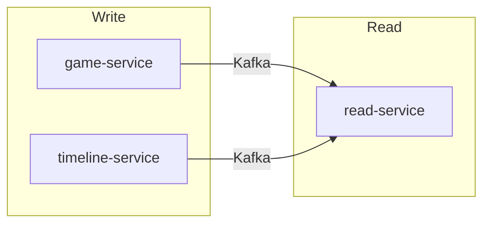

The write side and read side are separated at the service level.

## Separation

| Side | Services | Responsibility |
|---|---|---|
| **Write** | `game-service`, `timeline-service` | Commands, domain logic, aggregates |
| **Read** | `read-service` projection module | Denormalized read models per player |



## Eventual consistency

After a command is processed, the read model in `read-service` will be slightly behind. This is expected and correct.

Clients receive real-time updates via WebSocket instead of relying on read-your-writes consistency. A `202 Accepted` response on action submit is followed by a WebSocket push when the state updates.

## Rules

<Warning>
Never query the write-side database from a read endpoint. Write-side tables are optimised for domain logic, not for reads.
</Warning>

- Each service owns its own schema — no cross-service joins, no shared tables
- If a service needs data owned by another, it consumes that service's events and stores a local copy

## Database isolation

```
game-service DB          timeline-service DB       read-service DB
┌──────────────────┐     ┌──────────────────┐     ┌──────────────────┐
│ lobby            │     │ event_store       │     │ game_view        │
│ game             │     │ weaver_chain      │     │ player_view      │
│ action_round     │     │ saga_state        │     │ era_history      │
│ saga_state       │     └──────────────────┘     └──────────────────┘
│ event_publication│
└──────────────────┘
```

Migrations managed by Liquibase with changelogs per module to keep schema ownership clear.
