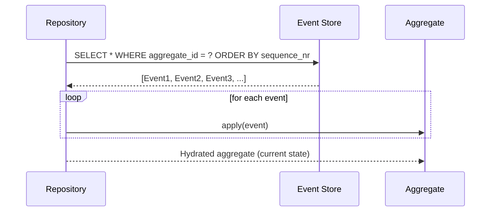

`timeline-service` is fully event-sourced. `FutureEvent` and `WeaverChain` aggregates are rebuilt by replaying their stored event history rather than reading a current-state row.

## How it works



## Event store schema

```sql
CREATE TABLE event_store (
    id             UUID PRIMARY KEY,
    aggregate_id   UUID         NOT NULL,
    aggregate_type VARCHAR(100) NOT NULL,
    event_type     VARCHAR(200) NOT NULL,
    event_version  INT          NOT NULL,
    payload        JSONB        NOT NULL,
    occurred_at    TIMESTAMPTZ  NOT NULL,
    sequence_nr    BIGINT       NOT NULL
);

CREATE UNIQUE INDEX ON event_store (aggregate_id, sequence_nr);
```

`sequence_nr` provides **optimistic concurrency** — a unique constraint violation means two processes tried to append events for the same aggregate concurrently. The loser retries.

## Snapshots

`WeaverChain` can span all 5 eras. Snapshots are taken every 20 events to avoid full replay on every load.

```
Snapshot @seq=20 → Event 21 → Event 22 → Event 23 → current state
```

On load: find the latest snapshot, replay only events after it.

## Why here specifically

`timeline-service` is the resolution engine — it applies card effects in a specific order and detects paradoxes. The full event history enables:

- **Deterministic resolution** — replay to any point in time
- **Debugging** — what was the state of this event at round 2?
- **Auditability** — the complete history of every probability shift
