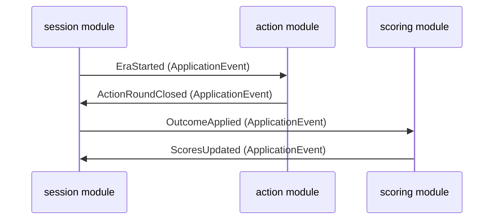

`game-service` and `read-service` are Spring Modulith applications. Modulith enforces module boundaries at runtime and in tests — giving microservice-style separation without the distributed systems overhead.

## Rules

| Rule | Detail |
|---|---|
| Cross-module communication | Only via `ApplicationEvent` — never by injecting beans from another module |
| Public API | Only a module's top-level public classes can be referenced from outside |
| Verification | `ApplicationModules.verify()` must pass on every build |

## Internal event flow in game-service



Modules never call each other's beans directly. All coordination goes through `ApplicationEventPublisher`.

## Shared module

`game-service/shared/` (`io.github.temporalrift.game.shared`) is a valid Modulith module for cross-cutting concerns — common value objects, shared enums. Treat it like any other module: don't bypass its boundaries.

## Verification test

```java
@Test
void applicationModulesShouldBeValid() {
    ApplicationModules.of(GameServiceApplication.class).verify();
}
```

This test fails if any module violates the boundary rules above and automatically generates a module dependency diagram.
