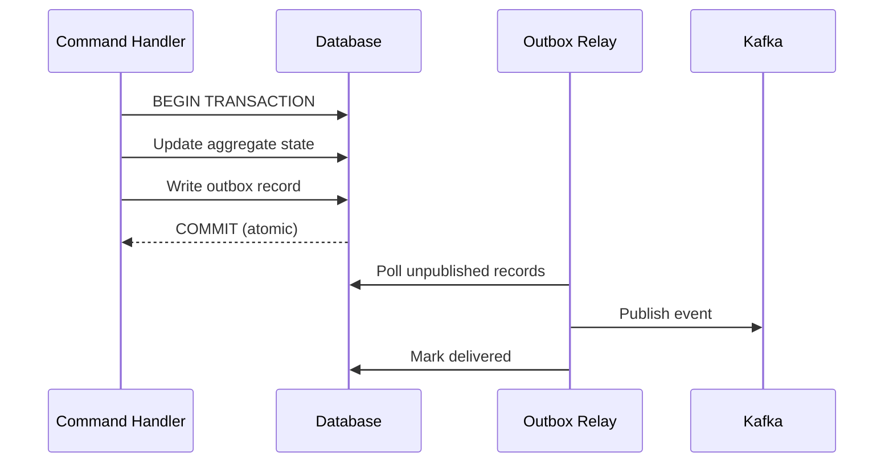

Every service that writes to the database and publishes to Kafka uses the outbox pattern. It guarantees that aggregate state and events are always consistent — even if the process crashes mid-operation.

## The problem

Without the outbox, a crash between the DB commit and the Kafka publish leaves state updated but event never sent — permanent inconsistency with no recovery path.

## The solution



The aggregate state update and the outbox record are written in **one local transaction**. If the process crashes after the commit, the relay picks up the undelivered record on restart.

## Implementation in game-service

`game-service` uses **Spring Modulith's JDBC event publication table** as the outbox. When a command handler publishes an `ApplicationEvent`, Modulith writes it to `event_publication` transactionally. A background relay reads and forwards to Kafka.

```yaml
spring:
  modulith:
    events:
      republish-outstanding-events-on-restart: true
```

<Warning>
**Never call `kafkaTemplate.send()` from a command handler.** If the transaction commits and the Kafka publish fails, the event is lost permanently. The outbox relay is the only component that sends to Kafka.
</Warning>

## Consumer idempotency

Because the relay delivers at-least-once, consumers may receive the same event more than once. Every consumer must be idempotent using `eventId` from the `EventEnvelope`:

```sql
CREATE TABLE processed_events (
    event_id     UUID PRIMARY KEY,
    processed_at TIMESTAMPTZ NOT NULL DEFAULT now()
);
```

Check before processing, insert in the same transaction as the business operation.
