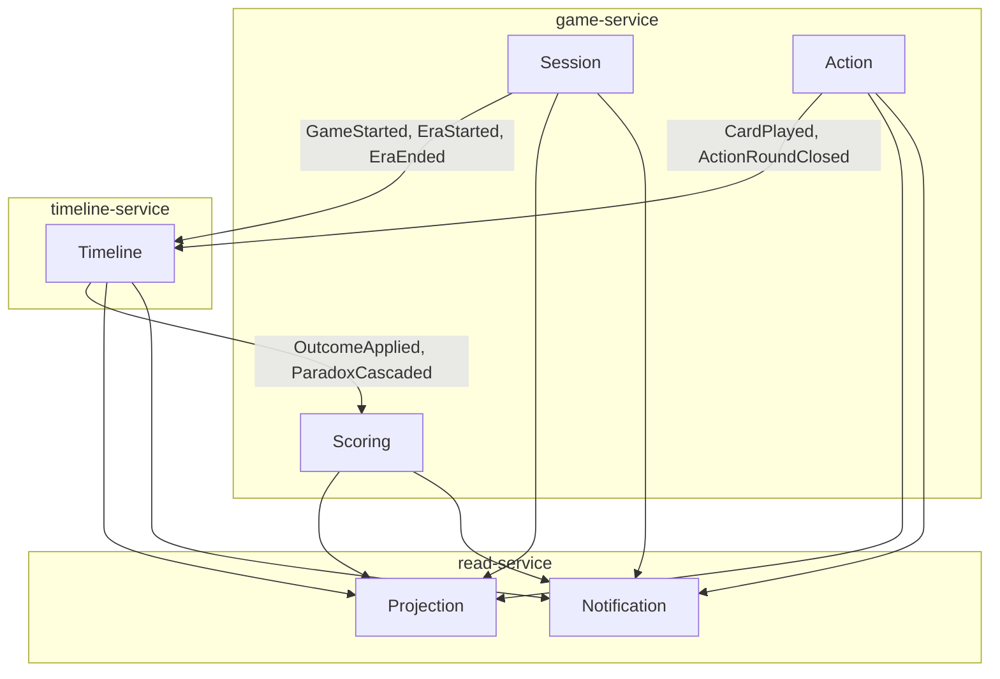

## Why this project exists

This is a portfolio backend project. Every architectural decision is made to demonstrate patterns correctly, not to optimise for simplicity. If something looks over-engineered for a game, that is intentional.

## Deployment model

Three deployables — not six, not one.

| Service | Type | Modules | Reason for boundary |
|---|---|---|---|
| `game-service` | Spring Modulith | session, action, scoring | Operationally coupled — same scaling profile, share the game lifecycle |
| `timeline-service` | Spring Boot | — | Hot path during resolution; needs independent scaling |
| `read-service` | Spring Modulith | projection, notification | Scales with WebSocket connections, not writes |

<AccordionGroup>
  <Accordion title="Why not 6 microservices?">
    Session, action, and scoring are tightly coupled operationally — they run during the same game phases and have similar load. Splitting them adds distributed systems overhead with no scaling benefit. The module boundary inside `game-service` enforces the same separation that a service boundary would, at zero operational cost.
  </Accordion>
  <Accordion title="Why not one monolith?">
    `timeline-service` is the hot path when all card plays hit it simultaneously during resolution. `read-service` scales with WebSocket connections independently of write traffic. These are real operational reasons to deploy separately.
  </Accordion>
</AccordionGroup>

## Context map

All inter-service communication goes through Kafka. No direct service-to-service HTTP calls.

## lobbyId vs gameId

<Note>
These are always different UUIDs representing different product concepts.
</Note>

| Identifier | Scope | Used as Kafka key |
|---|---|---|
| `lobbyId` | Pre-game lobby only. Irrelevant once the game starts. | No |
| `gameId` | Present for the entire game lifetime. Used in all domain events. | Yes |

`gameId` is pre-assigned at lobby creation — it's available as a Kafka partition key from the very first event (`LobbyCreated`), before the `Game` aggregate even exists.
