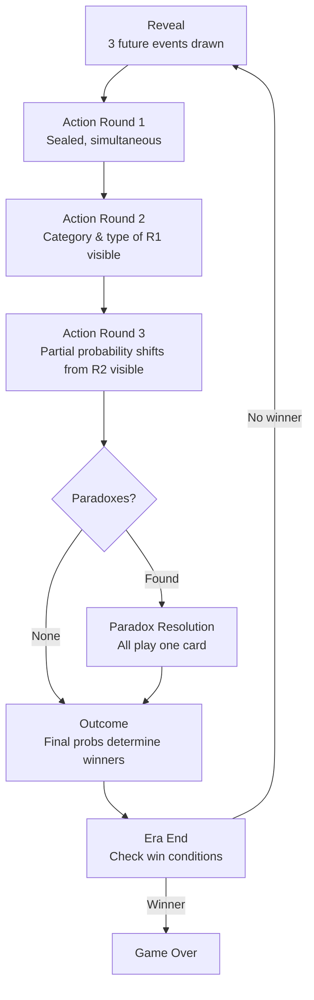

Each era (round) follows a fixed sequence of phases.

## Phase sequence

## Phase descriptions

| Phase | Description |
|---|---|
| **Reveal** | 3 future events drawn and shown with their 3 possible outcomes |
| **Action Round 1** | Players secretly submit 1 card or 1 special. Limited info — act on instinct |
| **Action Round 2** | Category and type of Round 1 actions visible. Adapt. |
| **Action Round 3** | Partial probability shifts from Round 2 visible. Final positioning. |
| **Paradox Check** | System detects paradoxes. None: skip to Outcome. Found: open Paradox Resolution. |
| **Paradox Resolution** | All players play one card (no specials). Paradox resolves or cascades. |
| **Outcome** | Final probabilities determine winning outcomes. Scores updated per faction rules. |
| **Era End** | Check win conditions. Advance to next era or trigger game end. |

## Timers

Default timer: **60 seconds per action round** (configurable via `game.rules.action-round-timer-seconds`).

Timer is player-count-dependent by configuration — never hard-code it:

| Players | Timer |
|---|---|
| 3 | 60s |
| 4 | 45s |
| 5 | 30–45s |

## Information visibility by round

| Info revealed | After Round 1 | After Round 2 | After Round 3 |
|---|---|---|---|
| Category + family of each action | ✔ | ✔ | ✔ |
| Probability band (LOW/MED/HIGH) | — | ✔ | ✔ |
| Exact probability (Scan only) | — | — | ✔ (to Scan player) |
| Which player played which | — | — | — (never public) |
