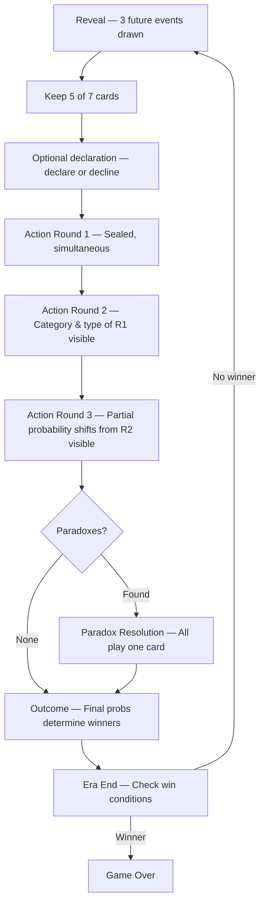

Each era (round) follows a fixed sequence of phases.

## Phase sequence

```mermaid
flowchart TD
  A[Reveal — 3 future events drawn] --> HS[Keep 5 of 7 cards]
  HS --> DW[Optional declaration — declare or decline]
  DW --> B[Action Round 1 — Sealed, simultaneous]
  B --> C[Action Round 2 — Category & type of R1 visible]
  C --> R3[Action Round 3 — Partial probability shifts from R2 visible]
  R3 --> E{Paradoxes?}
  E -->|None| G[Outcome — Final probs determine winners]
  E -->|Found| F[Paradox Resolution — All play one card]
  F --> G
  G --> H[Era End — Check win conditions]
  H -->|Winner| I[Game Over]
  H -->|No winner| A
```

## Phase descriptions

| Phase | Description |
|---|---|
| **Reveal** | 3 future events drawn and shown with their 3 possible outcomes; each player receives a private 7-card deal and selects 5 before Round 1 |
| **Declaration window** | Before Round 1, an Activist may use Rally or eligible Momentum to publicly declare one current-era event/outcome; declaring consumes their Round 1 action, while declining preserves an ordinary action |
| **Action Round 1** | Players secretly submit 1 card or 1 special. Read your cards and faction goal before confirming |
| **Action Round 2** | Category and family of Round 1 actions visible. A live Expose of an actual Round-1 Push, Suppress, or Swing reveals its signature and earns +2 at close. |
| **Action Round 3** | Partial probability shifts from Round 2 visible. A different qualifying Expose response produces a filtered behavior-change notice without changing the reveal score. |
| **Paradox Check** | System detects paradoxes. None: skip to Outcome. Found: open Paradox Resolution. |
| **Paradox Resolution** | Stabilize and Detonate are dealt now — they are never in the action hand. All players play one card (no specials). Paradox resolves or cascades. |
| **Outcome** | Final probabilities determine winning outcomes. Scores updated per faction rules. |
| **Era End** | Check win conditions. Advance to next era or trigger game end. |

Cards within a round resolve simultaneously: each card is measured against the probabilities at the start of the
resolution and the effects are added together, so submitting last gives no advantage. See
[Resolution](/sagas/resolution) for the exact order.

## Timers

Decision limits allow time to read and plan while preventing prolonged inactivity. Normal play uses the same
duration for three, four and five players:

| Phase | Decision limit | Configuration |
|---|---|---|
| Keep five cards | 300s | `game.rules.hand-selection-timer-seconds` |
| Each action round | 180s | `game.rules.action-round-timer-seconds` |
| Optional declaration | 120s | `game.rules.declaration-timer-seconds` |
| Paradox reaction | 120s | `game.rules.paradox-resolution-timer-seconds` |

The action and declaration settings remain keyed by player count. These values are configurable, and test profiles
explicitly use shorter limits. Completed decisions advance immediately. Declaration closes when every eligible
Activist has declared or declined, or immediately if none can declare; expiry handles remaining pending decisions.

## Finding your next step

The game client shows instructions for the current phase and what follows. After submitting, it explains that you
are waiting for other players or server confirmation. Cards & factions opens a searchable reference in the lobby
and on the board, with card timing and targets, grade differences, faction goals, special abilities and examples.
You can read it without losing a selected action or its targets.

Before declaring, review the mode, named event and outcome. A declaration succeeds only when that exact outcome
wins; a stalled or cascaded event cannot fulfill it. Decline declaration retains the ordinary Round 1 action.

## Information visibility by round

| Info revealed | After Round 1 | After Round 2 | After Round 3 |
|---|---|---|---|
| Category + family of each action | ✔ | ✔ | ✔ |
| Probability band (LOW/MED/HIGH) | — | ✔ | ✔ |
| Exact probability (Scan only) | — | — | ✔ (to Scan player) |
| Which player played each public category and family | ✔ | ✔ | ✔ |
| Exact card type or target of a round action | — | — | — (never in round summaries) |
| Activist declaration of record | ✔ | ✔ | ✔ |
| Exposed Round-1 signature | — | ✔ | ✔ |
| Expose Round-3 response signature | — | — | — (never public) |
