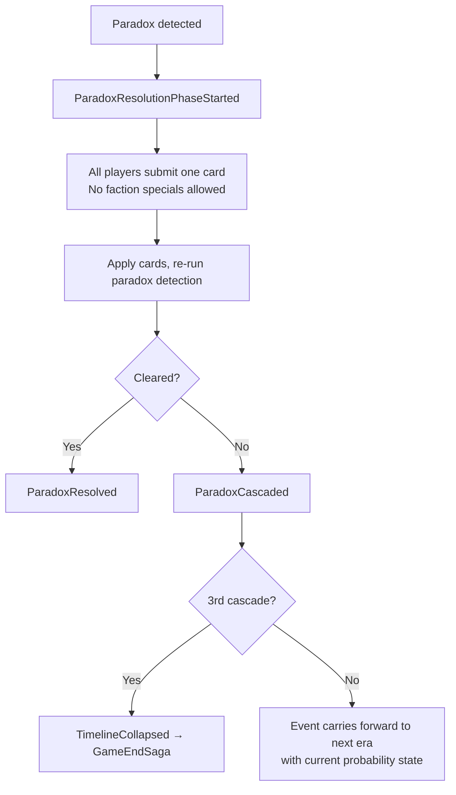

Paradoxes occur when contradictory conditions exist simultaneously on the same event at resolution time.

## Paradox types

| Type | Trigger | `paradoxType` |
|---|---|---|
| **Dead Heat** | Two outcomes reach equal probability | `DEAD_HEAT` |
| **Impossible Erasure** | Annihilated outcome has highest probability | `IMPOSSIBLE_ERASURE` |
| **Chain Conflict** | Two Weaver chains require opposite outcomes in the same era | `CHAIN_CONFLICT` |
| **Seal Breach** | A Sealed outcome's probability was modified (via Redirect or Amplify edge case) | `SEAL_BREACH` |

## Resolution flow

## Cascade rules

If a paradox cannot be resolved in the resolution phase, it **cascades**:
- The event produces no outcome for this era
- Score is zeroed for it this era
- The event carries forward to the next era with its probability state intact (not reset to 33/33/34)

**3 cascaded paradoxes → `TimelineCollapsed`** (special game ending — Erasers and Revisionists win; Prophets and Weavers lose).
