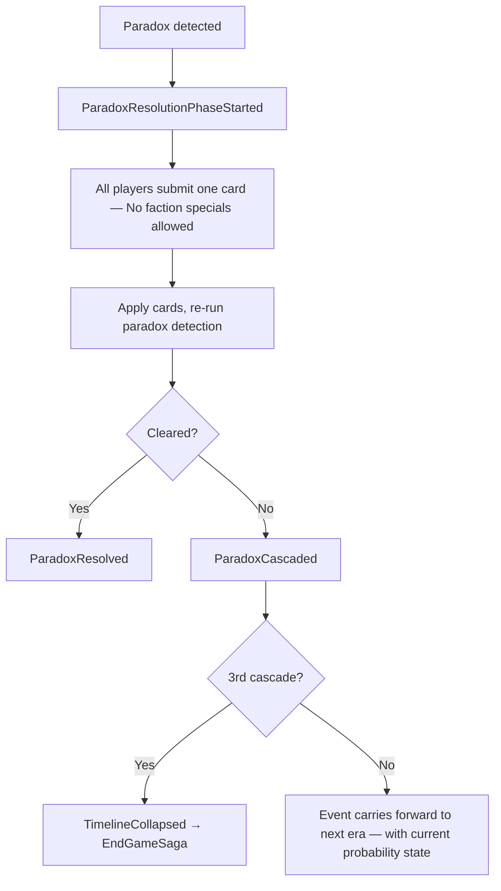

Paradoxes occur when contradictory conditions exist simultaneously on the same event at resolution time.

## Paradox types

| Type | Trigger | `paradoxType` |
|---|---|---|
| **Dead Heat** | Two outcomes a Collide equalized this era are still tied for the highest eligible probability | `DEAD_HEAT` |
| **Impossible Erasure** | Erasure leaves no eligible outcome with any probability, or no eligible outcome at all | `IMPOSSIBLE_ERASURE` |
| **Chain Conflict** | A Weaver chain's pending link is Annihilated without Tapestry protection | `CHAIN_CONFLICT` |
| **Seal Breach** | A Sealed outcome's probability was modified — blocked shifts fail without paradox; only an actual change breaches | `SEAL_BREACH` |

An ordinary tie is not a paradox. If outcomes tie for the lead without a Collide — after a Suppress, for example — the
weighted draw makes them equally likely. Erasing the leading outcome is not a paradox either: annihilated outcomes are
left out of the draw, and the remaining outcomes are drawn by their own probabilities. A Collide only counts for the
era it was played, so a tie carried into the next era needs a new Collide to raise a Dead Heat.

## Resolution flow

```mermaid
flowchart TD
  A[Paradox detected] --> B[ParadoxResolutionPhaseStarted]
  B --> C[All players submit one card — No faction specials allowed]
  C --> D[Apply cards, re-run paradox detection]
  D --> E{Cleared?}
  E -->|Yes| F[ParadoxResolved]
  E -->|No| G[ParadoxCascaded]
  G --> H{3rd cascade?}
  H -->|Yes| I[TimelineCollapsed → EndGameSaga]
  H -->|No| J[Event carries forward to next era — with current probability state]
```

## Cascade rules

If one or more paradox findings remain on an event after the resolution phase, that **event cascades once**:
- The event produces no outcome for this era
- Score is zeroed for it this era
- The event carries forward to the next era with its probability state intact (not reset to 33/33/34)

Each remaining finding is identified in the event's one cascade fact. Cleared findings are recorded separately.
Each detonator pays the base −2 penalty while every other player pays −4. Without a detonator, everyone pays −2.
These penalties apply once per cascaded event, even if several findings remain. A stabilized event has no cascade
penalty.

**3 cascaded events → `TimelineCollapsed`**. The collapsing event is the reveal-ordered cascade that raises the
global count from two to three. Only current-era Activists whose declaration targets that event win; every other
player loses this special ending.
