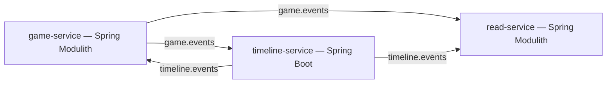

<CardGroup cols={2}>
  <Card title="Getting Started" icon="rocket" href="/getting-started/prerequisites">
    Set up local infrastructure and run game-service in minutes
  </Card>
  <Card title="Architecture" icon="diagram-project" href="/architecture/overview">
    Hexagonal Architecture, CQRS, Event Sourcing, Outbox, Spring Modulith
  </Card>
  <Card title="Game Design" icon="chess" href="/game-design/overview">
    Factions, cards, era structure, paradox system, and scoring
  </Card>
  <Card title="Sagas" icon="arrows-spin" href="/sagas/overview">
    Long-running distributed transactions with compensation flows
  </Card>
</CardGroup>

## What is this?

Temporal Rift is a **portfolio backend project** demonstrating production-grade distributed systems patterns. Every architectural decision is made to demonstrate patterns correctly — if something looks over-engineered for a game, that is intentional.

## Patterns demonstrated

| Pattern | Where |
|---|---|
| Hexagonal Architecture | Every module across all 3 services |
| Domain-Driven Design | Aggregates, bounded contexts, value objects as records |
| CQRS | Write models in `game-service` + `timeline-service`, read models in `read-service` |
| Event Sourcing | `timeline-service` rebuilds state by replaying events, not reading rows |
| Saga pattern | Long-running distributed transactions with compensation flows |
| Outbox pattern | Atomic write + event in one transaction; no direct Kafka publish |
| Spring Modulith | Enforced module boundaries inside a single deployable |

## Three deployables

| Service | Modules | Reason |
|---|---|---|
| `game-service` | session, action, scoring | Operationally coupled — same scaling profile, share the game lifecycle |
| `timeline-service` | — | Hot path during resolution; needs independent scaling |
| `read-service` | projection, notification | Scales with WebSocket connections, not writes |

## Stack

<CardGroup cols={3}>
  <Card title="Java 25 + Spring Boot 4" icon="java">
    Spring Modulith for module boundary enforcement
  </Card>
  <Card title="PostgreSQL + Liquibase" icon="database">
    Per-service schemas, no cross-service joins
  </Card>
  <Card title="Apache Kafka" icon="bolt">
    Event bus, partitioned by gameId
  </Card>
  <Card title="Testcontainers" icon="flask">
    Real PostgreSQL + Kafka in integration tests
  </Card>
  <Card title="ArchUnit" icon="shield">
    Architecture boundary enforcement in tests
  </Card>
  <Card title="OpenAPI 3" icon="code">
    Spec-first, controllers generated at build time
  </Card>
</CardGroup>
