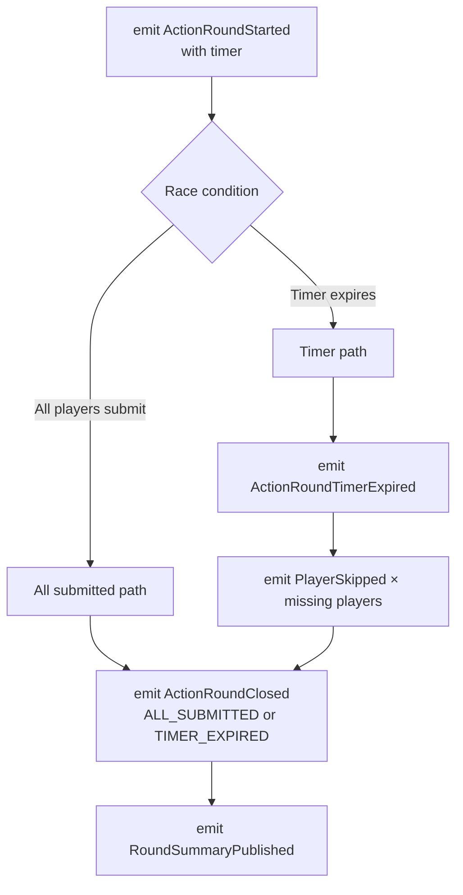

---


---


# ActionRoundSaga

**Trigger:** previous `ActionRoundClosed` or `HandDealt` (round 1)  
**Service:** `game-service` / action module

## Steps



## Race condition handling

Both paths — all players submitting and the timer expiring — must converge to **exactly one `ActionRoundClosed`**. This is a real distributed race condition that cannot be solved by Kafka ordering alone (it exists at the application level).

Implementation uses a **database row-level lock** on the `ActionRound` aggregate:

```
1. First closer acquires row-level lock, sets status → CLOSING
2. Emits ActionRoundClosed
3. Releases lock

Second closer (timer or late submit):
1. Attempts to acquire lock
2. Reads status = CLOSING
3. Exits without emitting — only one ActionRoundClosed per round
```

<Warning>
Never rely on Kafka ordering alone to solve this race. The race exists before events hit Kafka.
</Warning>


## Failure and compensation

| Failure | Compensation |
|---|---|
| Player submits after round closed | Reject silently, emit `LateSubmissionRejected` (private) |
| Timer service fails | Fallback close after 2× timeout, skip all remaining players |
| Player submits duplicate action | Reject, return error to player |
