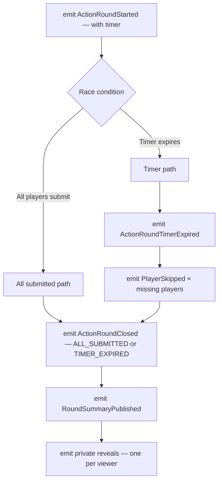

**Trigger:** previous `ActionRoundClosed` or all players' `HandSelected` events (round 1)
**Service:** `game-service` / action module

## Steps


```mermaid
flowchart TD
  A[emit ActionRoundStarted — with timer] --> B{Race condition}
  B -->|All players submit| C[All submitted path]
  B -->|Timer expires| D[Timer path]
  D --> E[emit ActionRoundTimerExpired]
  E --> F[emit PlayerSkipped × missing players]
  C --> G[emit ActionRoundClosed — ALL_SUBMITTED or TIMER_EXPIRED]
  F --> G
  G --> H[emit RoundSummaryPublished]
  H --> I[emit private reveals — one per viewer]
```

## Private reveals at round close

After the public round summary, the saga emits the Information-card results earned this round. Each goes to exactly
one player.

| Reveal | For |
|---|---|
| `ProbabilityStateRevealed` | every player with an active Scan this era — re-sent each round until the era ends |
| `InfluenceTraced` | each player who played Trace this round |
| `HandCardIntercepted` | each player who played Intercept this round |
| `PlayerJammed` | each player targeted by a Jam this round |

Reveals come after the summary so a player never sees private detail before the public fact it refines. None of them
names the player who triggered it.

## Race condition handling

Both paths — all players submitting and the timer expiring — must converge to **exactly one `ActionRoundClosed`**. This is a real distributed race condition that cannot be solved by Kafka ordering alone (it exists at the application level).

Implementation uses a **database row-level lock** on the `ActionRound` aggregate:

```
1. First closer acquires row-level lock, sets status → CLOSING
2. Emits ActionRoundClosed
3. Releases lock

Second closer (timer or late submit):
1. Attempts to acquire lock
2. Reads status = CLOSING
3. Exits without emitting — only one ActionRoundClosed per round
```

<Warning>
Never rely on Kafka ordering alone to solve this race. The race exists before events hit Kafka.
</Warning>


## Failure and compensation

| Failure | Compensation |
|---|---|
| Player submits after round closed | Reject silently, emit `LateSubmissionRejected` (private) |
| Timer service fails | Fallback close after 2× timeout, skip all remaining players |
| Player submits duplicate action | Reject, return error to player |
