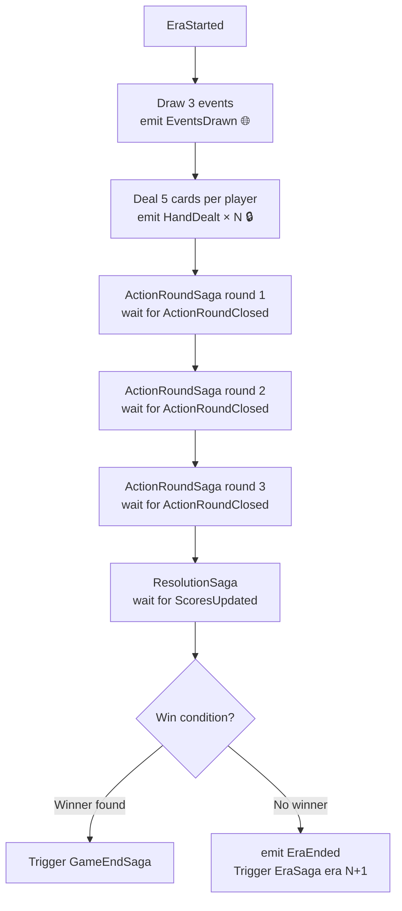

---

---

# EraSaga

**Trigger:** `EraStarted` event  
**Service:** `game-service` / session module

## Steps

## Failure and compensation

| Failure | Compensation |
|---|---|
| Deck runs out | Emit `GameEndedAbnormally` |
| ResolutionSaga fails | Emit `EraFailed`, trigger `GameEndedAbnormally` |
