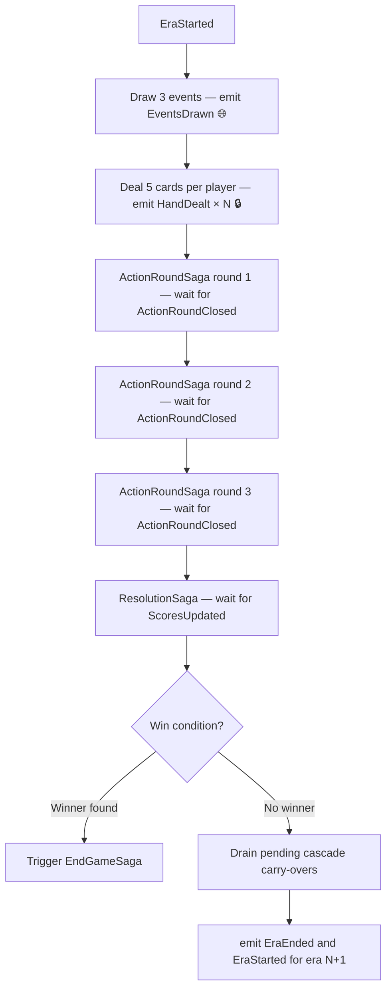

**Trigger:** `EraStarted` event  
**Service:** `game-service` / session module

## Steps

```mermaid
flowchart TD
  A[EraStarted] --> B[Draw 3 events — emit EventsDrawn 🌐]
  B --> C[Deal 5 cards per player — emit HandDealt × N 🔒]
  C --> D[ActionRoundSaga round 1 — wait for ActionRoundClosed]
  D --> E[ActionRoundSaga round 2 — wait for ActionRoundClosed]
  E --> F[ActionRoundSaga round 3 — wait for ActionRoundClosed]
  F --> G[ResolutionSaga — wait for ScoresUpdated]
  G --> H{Win condition?}
  H -->|Winner found| I[Trigger EndGameSaga]
  H -->|No winner| J[Drain pending cascade carry-overs]
  J --> K[emit EraEnded and EraStarted for era N+1]
```

## Cascade carry-forward

When session consumes `EraResolutionCompleted`, it applies the barrier's `CASCADED` entries in reveal order to the
global cascade counter and durably records their event IDs on the game. After scoring completes without ending the
game, session atomically drains that pending ordered list into the next `EraStarted`. This preserves the exact events
that replace fresh draws in the next era when resolution and scoring run in separate transactions.

## Failure and compensation

| Failure | Compensation |
|---|---|
| Deck runs out | Emit `GameEndedAbnormally` |
| ResolutionSaga fails | Emit `EraFailed`, trigger `GameEndedAbnormally` |
