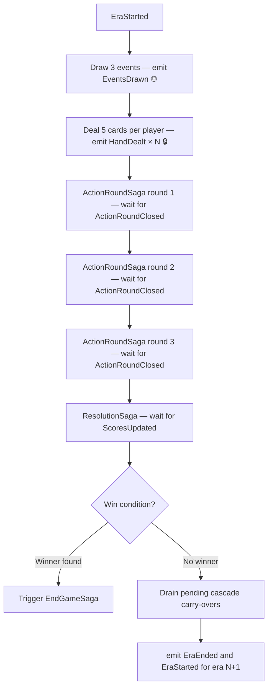

**Trigger:** `EraStarted` event  
**Service:** `game-service` / session module

## Steps

```mermaid
flowchart TD
  A[EraStarted] --> B[Draw 3 events — emit EventsDrawn 🌐]
  B --> C[Deal 5 cards per player — emit HandDealt × N 🔒]
  C --> D[ActionRoundSaga round 1 — wait for ActionRoundClosed]
  D --> E[ActionRoundSaga round 2 — wait for ActionRoundClosed]
  E --> F[ActionRoundSaga round 3 — wait for ActionRoundClosed]
  F --> G[ResolutionSaga — wait for ScoresUpdated]
  G --> H{Win condition?}
  H -->|Winner found| I[Trigger EndGameSaga]
  H -->|No winner| J[Drain pending cascade carry-overs]
  J --> K[emit EraEnded and EraStarted for era N+1]
```

On a continuing game, session drains the reveal-ordered carry-over set into `EraStarted.carryOverEventIds`. It counts
only `CASCADED` terminal entries toward timeline collapse, but retains both `CASCADED` and `STALLED` entries. The
following `EventsDrawn` labels each entry `FRESH`, `CASCADED`, or `STALLED`.

## Failure and compensation

| Failure | Compensation |
|---|---|
| Deck runs out | Emit `GameEndedAbnormally` |
| ResolutionSaga fails | Emit `EraFailed`, trigger `GameEndedAbnormally` |
