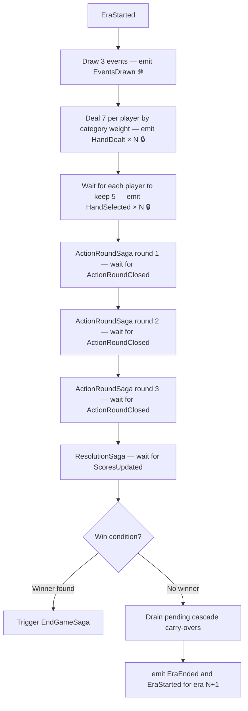

**Trigger:** `EraStarted` event  
**Service:** `game-service` / session module

## Steps

```mermaid
flowchart TD
  A[EraStarted] --> B[Draw 3 events — emit EventsDrawn 🌐]
  B --> C[Deal 7 per player by category weight — emit HandDealt × N 🔒]
  C --> D[Wait for each player to keep 5 — emit HandSelected × N 🔒]
  D --> E[ActionRoundSaga round 1 — wait for ActionRoundClosed]
  E --> F[ActionRoundSaga round 2 — wait for ActionRoundClosed]
  F --> G[ActionRoundSaga round 3 — wait for ActionRoundClosed]
  G --> H[ResolutionSaga — wait for ScoresUpdated]
  H --> I{Win condition?}
  I -->|Winner found| J[Trigger EndGameSaga]
  I -->|No winner| K[Drain pending cascade carry-overs]
  K --> L[emit EraEnded and EraStarted for era N+1]
```

Each player selects exactly five cards during the configured hand-selection window. The starting configuration for
`game.rules.hand-selection-timer-seconds` follows player count: 3→60s, 4→45s, 5→30s. A player who does not select in
time receives a uniformly random five-card subset of their seven cards (`HandSelected: TIMEOUT_RANDOM`); this does not
favor deal slots, categories, grades, or perceived card usefulness. A reconnect before the persisted deadline can
still select; after it, the player sees the completed selection.

On a continuing game, session drains the reveal-ordered carry-over set into `EraStarted.carryOverEventIds`. It counts
only `CASCADED` terminal entries toward timeline collapse, but retains both `CASCADED` and `STALLED` entries. The
following `EventsDrawn` labels each entry `FRESH`, `CASCADED`, or `STALLED`.

## Failure and compensation

| Failure | Compensation |
|---|---|
| Deck runs out | Emit `GameEndedAbnormally` |
| ResolutionSaga fails | Emit `EraFailed`, trigger `GameEndedAbnormally` |
