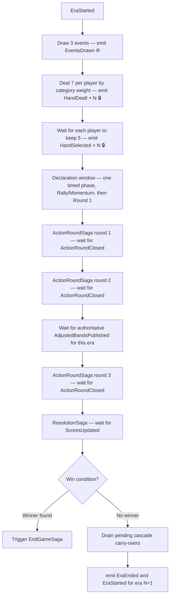

**Trigger:** `EraStarted` event  
**Service:** `game-service` / session module

## Steps

```mermaid
flowchart TD
  A[EraStarted] --> B[Draw 3 events — emit EventsDrawn 🌐]
  B --> C[Deal 7 per player by category weight — emit HandDealt × N 🔒]
  C --> D[Wait for each player to keep 5 — emit HandSelected × N 🔒]
  D --> DW[Declaration window — one timed phase, Rally/Momentum, then Round 1]
  DW --> E[ActionRoundSaga round 1 — wait for ActionRoundClosed]
  E --> F[ActionRoundSaga round 2 — wait for ActionRoundClosed]
  F --> BP[Wait for authoritative AdjustedBandsPublished for this era]
  BP --> G[ActionRoundSaga round 3 — wait for ActionRoundClosed]
  G --> H[ResolutionSaga — wait for ScoresUpdated]
  H --> I{Win condition?}
  I -->|Winner found| J[Trigger EndGameSaga]
  I -->|No winner| K[Drain pending cascade carry-overs]
  K --> L[emit EraEnded and EraStarted for era N+1]
```

Each player selects exactly five cards during the configured hand-selection window. `game.rules.hand-selection-timer-seconds` is one
duration for every player count, 300 seconds in normal play, because all players select at the same time. A player who does not select in
time receives a uniformly random five-card subset of their seven cards (`HandSelected: TIMEOUT_RANDOM`); this does not
favor deal slots, categories, grades, or perceived card usefulness. A reconnect before the persisted deadline can
still select; after it, the player sees the completed selection.

The last terminal selection opens one timed declaration window for the era; the window cannot be skipped by the last
keep. Opening publishes `DeclarationWindowOpened` with the window's deadline once, and gives each player who can
declare a private `DeclarationOptionsOffered` listing their eligible modes; a repeated or late opening publishes
neither again. An Activist may record one Rally or eligible Momentum declaration while it is open, consuming their
Round-1 action. An eligible player may instead explicitly decline, preserving their ordinary Round 1 action.
The phase persists the offered player set and each terminal decision. The final declaration or decline closes the
window immediately; an empty eligible set also completes immediately. Missing participant state or faction defers
opening until the durable trigger is retried. The normal 120-second limit is a fallback for pending decisions.
Completion and expiry converge under the same phase lock, so Action Round 1 starts exactly once.

Between Round 2 and Round 3, the saga waits for timeline's authoritative band publication. Readiness is persisted
for the current era under the saga lock, so an early band signal survives until the round-close listener runs.
Round 3 and its timer open only after both facts exist. Late bands keep the phase closed; restart, duplicates,
and stale-era records cannot bypass the barrier.

On a continuing game, session drains the reveal-ordered carry-over set into `EraStarted.carryOverEventIds`. It counts
only `CASCADED` terminal entries toward timeline collapse, but retains both `CASCADED` and `STALLED` entries. The
following `EventsDrawn` labels each entry `FRESH`, `CASCADED`, or `STALLED`.

## Failure and compensation

| Failure | Compensation |
|---|---|
| Deck runs out | End the game, emit `GameEndedAbnormally`; `EndGameSaga` publishes `GameEnded` (`DECK_EXHAUSTED`) |
| ResolutionSaga fails | Emit `EraFailed`, end the game, emit `GameEndedAbnormally`; `EndGameSaga` publishes `GameEnded` (`RESOLUTION_FAILED`) |
