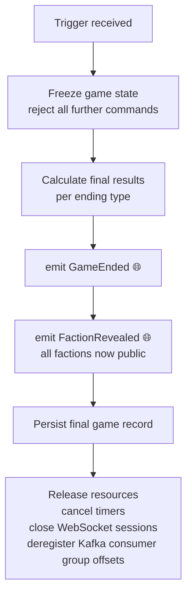

**Trigger:** `WinConditionMet`, `TimelineCollapsed`, or `TimelineStabilized`  
**Service:** `game-service` / session module

## Steps

## Failure and compensation

| Failure | Compensation |
|---|---|
| Final record persistence fails | Retry with exponential backoff — events already emitted so players have results |
| Resource cleanup fails | Log and alert — non-blocking, game result already delivered |

Resource cleanup failure is non-critical because the game result has already been delivered to players via `GameEnded` and `FactionRevealed`. Leaked resources (timers, WebSocket sessions) are cleaned up by TTL mechanisms.
