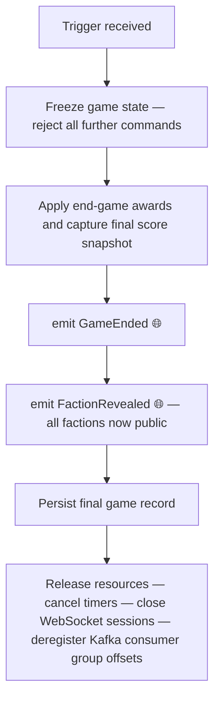

**Trigger:** `WinConditionMet`, `TimelineCollapsed`, `TimelineStabilized`, or `GameEndedAbnormally`  
**Service:** `game-service` / session module

## Steps

```mermaid
flowchart TD
  A[Trigger received] --> B[Freeze game state — reject all further commands]
  B --> C[Apply end-game awards and capture final score snapshot]
  C --> D[emit GameEnded 🌐]
  D --> E[emit FactionRevealed 🌐 — all factions now public]
  E --> F[Persist final game record]
  F --> G[Release resources — cancel timers — close WebSocket sessions — deregister Kafka consumer group offsets]
```

## Failure and compensation

| Failure | Compensation |
|---|---|
| Final record persistence fails | Retry with exponential backoff — events already emitted so players have results |
| Resource cleanup fails | Log and alert — non-blocking, game result already delivered |

Resource cleanup failure is non-critical because the game result has already been delivered to players via `GameEnded` and `FactionRevealed`. Leaked resources (timers, WebSocket sessions) are cleaned up by TTL mechanisms.

The `all-players-abandoned` trigger finishes with `GameEnded.endReason = ALL_PLAYERS_ABANDONED`, an empty
winner set, every participant's final score, and the normal faction reveal. If era scoring is in flight, the
producer waits for it before triggering finalization.
