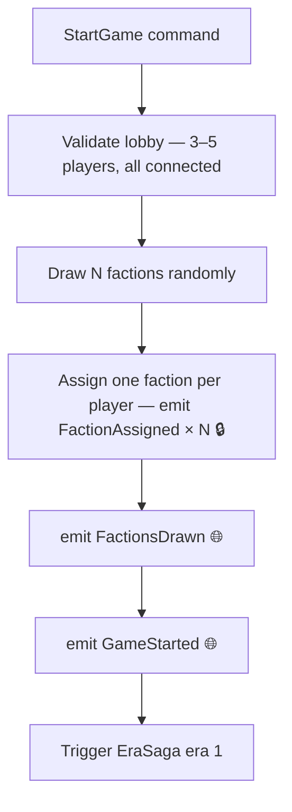

**Trigger:** `StartGame` command from host player  
**Service:** `game-service` / session module

## Steps

## Failure and compensation

| Failure | Compensation |
|---|---|
| Faction assignment fails midway | Unassign all, emit `GameStartFailed`, return lobby to `WAITING` |
| Player disconnects during steps 1–5 | Cancel start, emit `GameStartCancelled` |

The faction assignment must be atomic — either all players get a faction or none do. The saga handles partial failure by rolling back all assignments before emitting `GameStartFailed`.
