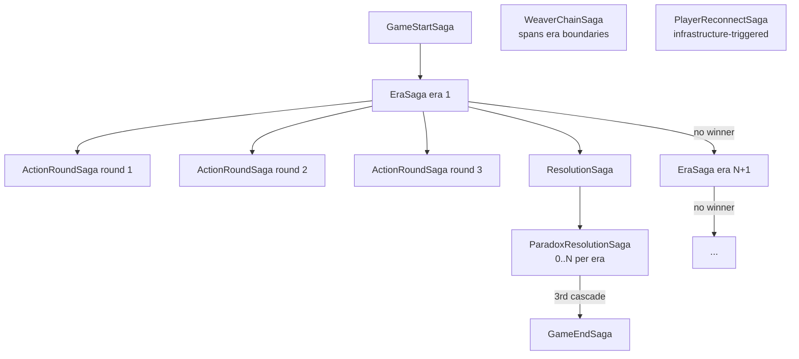

---

---

# Sagas Overview

Sagas are long-running business transactions coordinated through domain events. Each saga instance is persisted to the database and survives service restarts.

## Saga state

Every saga has:
- `sagaId` — unique identifier
- `gameId` — the game this saga belongs to
- `status` — `STARTED` | `WAITING` | `COMPLETED` | `COMPENSATING` | `FAILED`
- `currentStep` — where in the workflow we are
- `context` — serialized blob of saga-specific data

**Saga state must be persisted before emitting events.** If the process crashes after the event is emitted but before the state is saved, the saga cannot resume correctly.

## Sagas summary

| Saga | Service | Trigger | Key complexity |
|---|---|---|---|
| `GameStartSaga` | game-service / session | `StartGame` command | Faction assignment atomicity |
| `EraSaga` | game-service / session | `EraStarted` | Orchestrates 3 child sagas |
| `ActionRoundSaga` | game-service / action | Round N opened | Timer vs all-submitted race condition |
| `ResolutionSaga` | timeline-service | `ResolutionStarted` | Action ordering, paradox branching |
| `ParadoxResolutionSaga` | timeline-service | `ParadoxDetected` | Nested within ResolutionSaga |
| `GameEndSaga` | game-service / session | Win / collapse / stabilize | Resource cleanup |
| `WeaverChainSaga` | timeline-service | `THREAD` special action | Only saga spanning multiple eras |
| `PlayerReconnectSaga` | game-service / session | WebSocket disconnect | Grace timer, state restoration |

## Nesting map

## Orchestration rule

Sagas orchestrate — they do not contain business logic. **Invariants belong in aggregates.**

A saga that finds an invariant violated should emit a compensation event and return the system to a consistent state, not attempt to enforce the rule itself.
