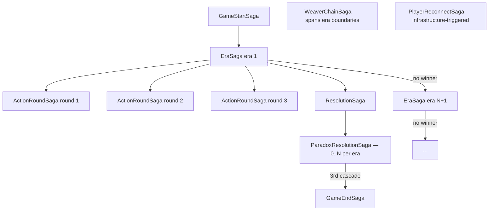

Sagas are long-running business transactions coordinated through domain events. Each saga instance is persisted to the database and survives service restarts.

## Saga state

Each saga instance is stored as a row with the following fields:

| Field | Description |
|---|---|
| `sagaId` | Unique identifier for this saga instance |
| `gameId` | The game this saga belongs to |
| `status` | `STARTED` \| `WAITING` \| `COMPLETED` \| `COMPENSATING` \| `FAILED` |
| `currentStep` | Last completed step in the workflow |
| `context` | Serialized saga-specific data needed to resume |

State is persisted in the same transaction as the event that triggered the step. If the process crashes mid-saga, the relay republishes the outbox event on restart and the saga continues from its last persisted step.

## Sagas summary

| Saga | Service | Trigger | Key complexity |
|---|---|---|---|
| `GameStartSaga` | game-service / session | `StartGame` command | Faction assignment atomicity |
| `EraSaga` | game-service / session | `EraStarted` | Orchestrates 3 child sagas |
| `ActionRoundSaga` | game-service / action | Round N opened | Timer vs all-submitted race condition |
| `ResolutionSaga` | timeline-service | `ResolutionStarted` | Action ordering, paradox branching |
| `ParadoxResolutionSaga` | timeline-service | `ParadoxDetected` | Nested within ResolutionSaga |
| `GameEndSaga` | game-service / session | Win / collapse / stabilize | Resource cleanup |
| `WeaverChainSaga` | timeline-service | `THREAD` special action | Only saga spanning multiple eras |
| `PlayerReconnectSaga` | game-service / session | WebSocket disconnect | Grace timer, state restoration |

## Nesting map

## Orchestration rule

Sagas coordinate — they sequence steps, wait for events, and trigger compensations. Business rules and invariant enforcement belong in aggregates, not in sagas.

When a saga step encounters a violated invariant, it emits a compensation event to unwind previous steps and return the system to a consistent state.
