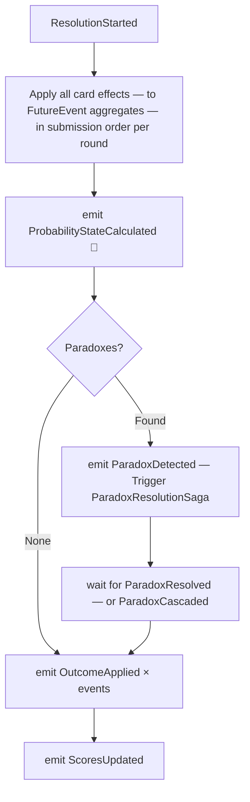

**Trigger:** `ResolutionStarted` (fired by game-service after round 3 closes)  
**Service:** `timeline-service`

## Steps

## Card effect application order

Effects are applied in this fixed order within each round — not submission timestamp order:

| Priority | Card / Effect | Reason |
|---|---|---|
| 1 | `NULLIFY` | Cancels the last card; must be applied before the cancelled card has any effect |
| 2 | `SEAL` | Locks outcomes before other effects can modify them |
| 3 | `ANNIHILATE` | Removes outcomes before probability shifts |
| 4 | `CORRUPT` | Inverts other cards before they apply |
| 5 | `AMPLIFY` | Doubles the next card's effect |
| 6+ | All remaining cards | In submission timestamp order |

## Failure and compensation

| Failure | Compensation |
|---|---|
| `ParadoxResolutionSaga` times out | Force cascade on all unresolved paradoxes |
| Probability state doesn't sum to 100 | Emit `ResolutionFailed`, trigger `GameEndedAbnormally` |
| Conflicting effects produce impossible state | Log, apply last-write-wins, emit `ResolutionWarning` |
