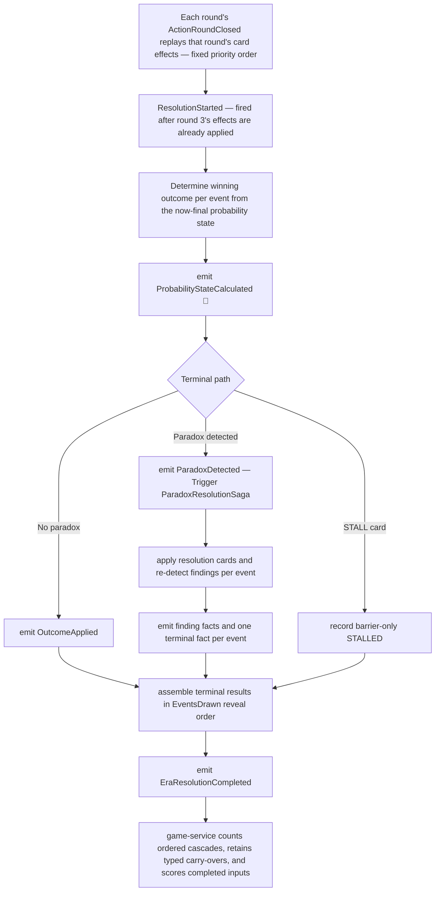

**Trigger:** `ResolutionStarted` (fired by game-service after round 3 closes)  
**Service:** `timeline-service`

Card effects are applied per round, not when `ResolutionStarted` arrives: each round's `ActionRoundClosed` replays
that round's card effects against the `FutureEvent` aggregates in the fixed priority order below. By the time
`ResolutionStarted` fires, all three rounds' effects are already applied — this saga only determines the winning
outcome from that final probability state and detects paradoxes.

## Steps

```mermaid
flowchart TD
  R[Each round's ActionRoundClosed replays that round's card effects — fixed priority order] --> A
  A[ResolutionStarted — fired after round 3's effects are already applied] --> B[Determine winning outcome per event from the now-final probability state]
  B --> C[emit ProbabilityStateCalculated 📢]
  C --> D{Terminal path}
  D -->|No paradox| E[emit OutcomeApplied]
  D -->|Paradox detected| F[emit ParadoxDetected — Trigger ParadoxResolutionSaga]
  F --> G[apply resolution cards and re-detect findings per event]
  G --> H[emit finding facts and one terminal fact per event]
  D -->|STALL card| I[record barrier-only STALLED]
  E --> J[assemble terminal results in EventsDrawn reveal order]
  H --> J
  I --> J
  J --> K[emit EraResolutionCompleted]
  K --> L[game-service counts ordered cascades, retains typed carry-overs, and scores completed inputs]
```

`EraResolutionCompleted` is emitted once after all resolvable `OutcomeApplied` and `ParadoxCascaded` facts have been
durably produced. An event with several persistent paradox findings emits one `ParadoxCascaded` fact identifying
each finding and has one `CASCADED` terminal result. A `STALL` card ends its selected event as `STALLED` in this
barrier; it produces neither an outcome fact nor a paradox fact. It contains one terminal result for every active
event in the original `EventsDrawn.events`
order. Consumers must use this barrier—not individual cascade arrival order—to determine the collapsing event and
scoring completion. `CASCADED` entries advance collapse accounting; both `CASCADED` and `STALLED` entries carry
forward in the barrier's reveal order. A paradox-resolution timeout force-cascades each event with unresolved
findings once; it does not produce `STALLED`.

## Card effect application order

Effects are applied in this fixed order within each round. Submission time never affects the result:

| Priority | Card / Effect | Reason |
|---|---|---|
| 1 | `NULLIFY` | Cancels the named player's eligible action before it has any effect |
| 2 | `SEAL` | Locks outcomes before other effects can modify them |
| 3 | `ANNIHILATE` | Removes outcomes before probability shifts |
| 4 | `CORRUPT` | Inverts other cards before they apply |
| 5 | `MIMIC` | Picks the strongest qualifying card (largest base magnitude, then a card raising the outcome over `SUPPRESS`) and adds an independent copy at its base magnitude to the simultaneous tier |
| 6 | `AMPLIFY` | Multiplies the named player's eligible card effect |
| 7 | All remaining cards, including `COLLIDE`, plus `MIMIC` copies | Simultaneously |

`NULLIFY`, `REDIRECT` and `AMPLIFY` each target a named player, never an action's submission position. Each is a
clean no-op when its target skipped, has no eligible action, or was already cancelled.

Redirect applies to a live Push, Suppress, or Swing without carrying an outcome coordinate. After Corrupt establishes
the shift's effective destination, Redirect advances through the event's displayed outcome order, wrapping around and
skipping the current destination, annihilated outcomes, and a Swing's source. It preserves Amplify's multiplier and
lets Rally evaluate the redirected destination. Mimic's copy uses the submitted direct transfer; it never
inherits Redirect.

In tier 7, each card on an event is evaluated alone against that event's probabilities at the start of the tier,
using the ordinary single-card rules (cap, redistribution, sealed outcomes, Collide's midpoint). Their changes are added
together, and the sum is fitted once into the configured floor and ceiling. Sealed outcomes stay fixed, the total stays
100, and any overflow is shared equally by the outcomes that still have room. A single card resolves exactly as it
would alone. Identical Collides count once. A Collide pair counts toward a Dead Heat only if it is still equal after
the combined result. `STALL` is unaffected by order. `PUSH` and `SUPPRESS` submitted during Paradox Resolution combine
the same way.

`STABILIZE` and `DETONATE` (the other two Group 4 "Paradox" cards) never go through this ordering — during
`ParadoxResolutionSaga`, a player submits exactly one card, chosen from `PUSH`, `SUPPRESS`, `STABILIZE`, or
`DETONATE`, once a paradox is already detected, not an ordinary card played during a round.

## Failure and compensation

| Failure | Compensation |
|---|---|
| `ParadoxResolutionSaga` times out | Force one cascade per event with unresolved paradox findings |
| Probability state doesn't sum to 100 | `timeline-service` emits `ResolutionFailed`; game-service's `EraSaga` consumes it, emits `EraFailed`, and triggers `GameEndedAbnormally` |
