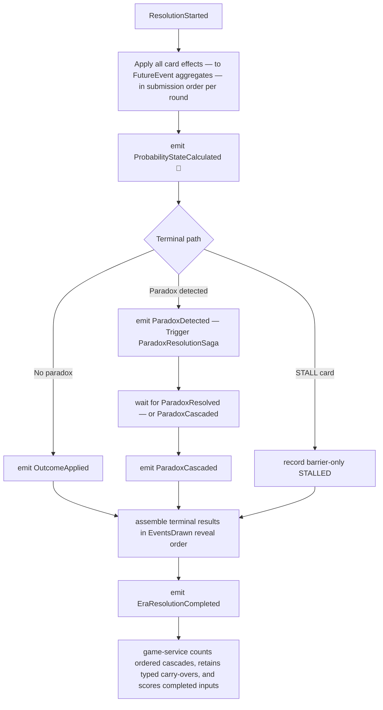

**Trigger:** `ResolutionStarted` (fired by game-service after round 3 closes)  
**Service:** `timeline-service`

## Steps

```mermaid
flowchart TD
  A[ResolutionStarted] --> B[Apply all card effects — to FutureEvent aggregates — in submission order per round]
  B --> C[emit ProbabilityStateCalculated 📢]
  C --> D{Terminal path}
  D -->|No paradox| E[emit OutcomeApplied]
  D -->|Paradox detected| F[emit ParadoxDetected — Trigger ParadoxResolutionSaga]
  F --> G[wait for ParadoxResolved — or ParadoxCascaded]
  G --> H[emit ParadoxCascaded]
  D -->|STALL card| I[record barrier-only STALLED]
  E --> J[assemble terminal results in EventsDrawn reveal order]
  H --> J
  I --> J
  J --> K[emit EraResolutionCompleted]
  K --> L[game-service counts ordered cascades, retains typed carry-overs, and scores completed inputs]
```

`EraResolutionCompleted` is emitted once after all resolvable `OutcomeApplied` and `ParadoxCascaded` facts have been
durably produced. A `STALL` card ends its selected event as `STALLED` in this barrier; it produces neither an outcome
fact nor a paradox fact. It contains one terminal result for every active event in the original `EventsDrawn.events`
order. Consumers must use this barrier—not individual cascade arrival order—to determine the collapsing event and
scoring completion. `CASCADED` entries advance collapse accounting; both `CASCADED` and `STALLED` entries carry
forward in the barrier's reveal order. A paradox-resolution timeout force-cascades unresolved paradoxes; it does not
produce `STALLED`.

## Card effect application order

Effects are applied in this fixed order within each round — not submission timestamp order:

| Priority | Card / Effect | Reason |
|---|---|---|
| 1 | `NULLIFY` | Cancels the last card; must be applied before the cancelled card has any effect |
| 2 | `SEAL` | Locks outcomes before other effects can modify them |
| 3 | `ANNIHILATE` | Removes outcomes before probability shifts |
| 4 | `CORRUPT` | Inverts other cards before they apply |
| 5 | `AMPLIFY` | Doubles the next card's effect |
| 6+ | All remaining cards, including `COLLIDE` | In submission timestamp order |

`STABILIZE` and `DETONATE` (the other two Group 4 "Paradox" cards) never go through this ordering — they're the
single reactive card a player submits during `ParadoxResolutionSaga` once a paradox is already detected, not an
ordinary card played during a round.

## Failure and compensation

| Failure | Compensation |
|---|---|
| `ParadoxResolutionSaga` times out | Force cascade on all unresolved paradoxes |
| Probability state doesn't sum to 100 | `timeline-service` emits `ResolutionFailed`; game-service's `EraSaga` consumes it, emits `EraFailed`, and triggers `GameEndedAbnormally` |
| Conflicting effects produce impossible state | Log, apply last-write-wins, emit `ResolutionWarning` |
