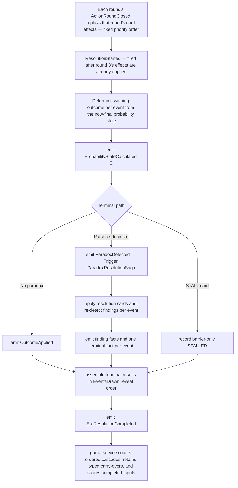

**Trigger:** `ResolutionStarted` (fired by game-service after round 3 closes)  
**Service:** `timeline-service`

Card effects are applied per round, not when `ResolutionStarted` arrives: each round's `ActionRoundClosed` replays
that round's card effects against the `FutureEvent` aggregates in the fixed priority order below. By the time
`ResolutionStarted` fires, all three rounds' effects are already applied — this saga only determines the winning
outcome from that final probability state and detects paradoxes.

## Steps

```mermaid
flowchart TD
  R[Each round's ActionRoundClosed replays that round's card effects — fixed priority order] --> A
  A[ResolutionStarted — fired after round 3's effects are already applied] --> B[Determine winning outcome per event from the now-final probability state]
  B --> C[emit ProbabilityStateCalculated 📢]
  C --> D{Terminal path}
  D -->|No paradox| E[emit OutcomeApplied]
  D -->|Paradox detected| F[emit ParadoxDetected — Trigger ParadoxResolutionSaga]
  F --> G[apply resolution cards and re-detect findings per event]
  G --> H[emit finding facts and one terminal fact per event]
  D -->|STALL card| I[record barrier-only STALLED]
  E --> J[assemble terminal results in EventsDrawn reveal order]
  H --> J
  I --> J
  J --> K[emit EraResolutionCompleted]
  K --> L[game-service counts ordered cascades, retains typed carry-overs, and scores completed inputs]
```

`EraResolutionCompleted` is emitted once after all resolvable `OutcomeApplied` and `ParadoxCascaded` facts have been
durably produced. An event with several persistent paradox findings emits one `ParadoxCascaded` fact identifying
each finding and has one `CASCADED` terminal result. A `STALL` card ends its selected event as `STALLED` in this
barrier; it produces neither an outcome fact nor a paradox fact. It contains one terminal result for every active
event in the original `EventsDrawn.events`
order. Consumers must use this barrier—not individual cascade arrival order—to decide timeline collapse and
scoring completion. `CASCADED` entries advance collapse accounting; both `CASCADED` and `STALLED` entries carry
forward in the barrier's reveal order. A paradox-resolution timeout force-cascades each event with unresolved
findings once; it does not produce `STALLED`.

## Card effect application order

Effects are applied in this fixed order within each round. Submission time never affects the result:

Before applying any tier, replay ignores actions targeting an event stalled in an earlier round of the same era.
Push, Suppress, Swing, Collide, Seal, Annihilate, Mimic copies, and Cascade intents cannot affect that event;
ignored actions produce no applied-effect confirmation or Weaver chain change. Stall and other actions submitted
in the same round still resolve together in tier order. A Stall cancelled by Nullify leaves later rounds eligible.
Scan remains accepted and reveals only active targets, including when its list mixes active and stalled events.
The lock clears when the event returns in the next era.

| Priority | Card / Effect | Reason |
|---|---|---|
| 1 | `NULLIFY` | Cancels each named player's eligible action (one player at grade I, two at grade II) before it has any effect |
| 2 | `SEAL` | Locks outcomes before other effects can modify them |
| 3 | `TAPESTRY` | Arms chain protection before a same-round Annihilate can reach the pending link |
| 4 | `ANNIHILATE` | Removes outcomes before probability shifts |
| 5 | `REWEAVE`, then `THREAD` | Judged against the post-Annihilate outcomes: a Reweave escapes a same-round Annihilate, and a Thread naming an annihilated outcome is rejected |
| 6 | `CORRUPT` | Inverts other cards before they apply |
| 7 | `MIMIC` | Picks the strongest inward transfer toward the named outcome (a Push targeting it or a Swing destined for it; largest base magnitude, then lowest player id — never a Suppress or a Swing away from it) and adds an independent copy at its base magnitude to the simultaneous tier |
| 8 | `AMPLIFY` | Multiplies the named player's eligible card effect by the strongest multiplier naming it; several never compound |
| 9 | All remaining cards, including `COLLIDE`, plus `MIMIC` copies and each accepted `THREAD`'s favorable shift | Simultaneously |

`NULLIFY`, `REDIRECT` and `AMPLIFY` each target named players, never an action's submission position. Each named
target is independently a clean no-op when that player skipped, has no eligible action, or was already cancelled, so
a grade II `NULLIFY` still cancels its other target. All `NULLIFY` cancellations, including mutual ones, are computed
simultaneously before any later tier.

An Activist's Rally or Momentum declaration is that player's Round 1 action. Momentum's +10 percentage-point bonus
lands on the declared outcome before any Round 1 tier, so Round 1 actions (including a Thread's shift) see the boosted
probabilities; a Round 1
`NULLIFY` naming the declarer cancels it, and the bonus never applies.

Redirect applies to a live Push, Suppress, or Swing without carrying an outcome coordinate. After Corrupt establishes
the shift's effective destination, Redirect advances through the event's displayed outcome order, wrapping around and
skipping the current destination, annihilated outcomes, and a Swing's source. It preserves Amplify's multiplier and
lets Rally evaluate the redirected destination. Mimic's copy uses the submitted direct transfer; it never
inherits Redirect.

Several modifiers naming the same player combine without depending on submission order. Only the largest `AMPLIFY`
multiplier among them applies; the base magnitude times that multiplier is rounded half-up to a whole point once,
before Rally and before the floor/ceiling fit. An `AMPLIFY` on a `COLLIDE` has no effect. Several `REDIRECT` cards move
the shift one step, exactly as a single `REDIRECT` does.

In tier 9, each effect on an event is evaluated alone against that event's probabilities at the start of the tier,
using the ordinary single-card rules (cap, redistribution, sealed outcomes, Collide's midpoint). Their changes are added
together, and the sum is fitted once into the configured floor and ceiling. Sealed outcomes stay fixed, the total stays
100, and any overflow is shared equally by the outcomes that still have room. A single card resolves exactly as it
would alone. Identical Collides count once. A Collide pair counts toward a Dead Heat only if it is still equal after
the combined result. `STALL` is unaffected by order. `PUSH` and `SUPPRESS` submitted during Paradox Resolution combine
the same way.

`STABILIZE` and `DETONATE` (the other two Group 4 "Paradox" cards) never go through this ordering — during
`ParadoxResolutionSaga`, a player submits exactly one card, chosen from `PUSH`, `SUPPRESS`, `STABILIZE`, or
`DETONATE`, once a paradox is already detected, not an ordinary card played during a round.

## Failure and compensation

| Failure | Compensation |
|---|---|
| `ParadoxResolutionSaga` times out | Force one cascade per event with unresolved paradox findings |
| Probability state doesn't sum to 100 | `timeline-service` emits `ResolutionFailed`; game-service's `EraSaga` consumes it, emits `EraFailed`, and triggers `GameEndedAbnormally` |
