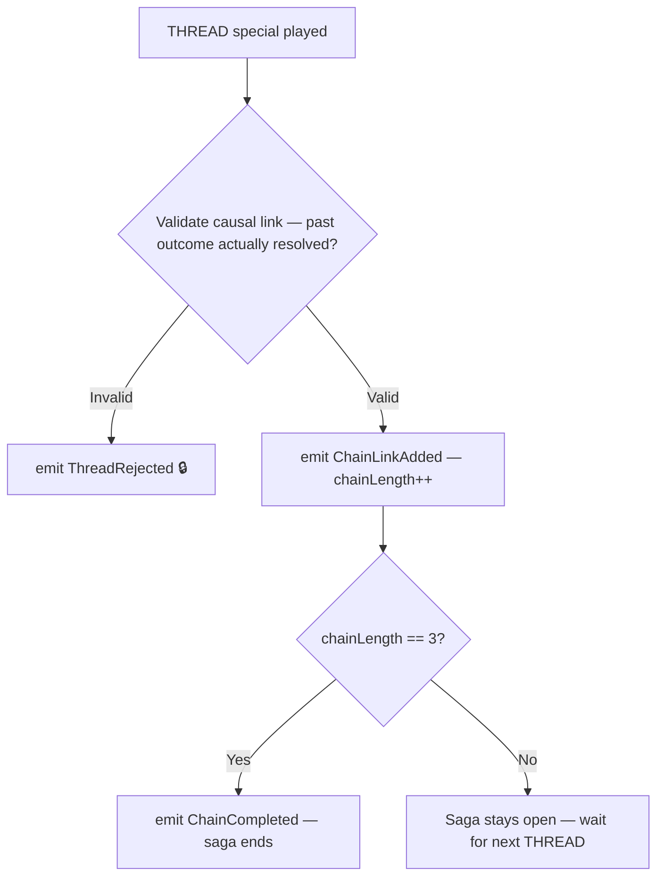
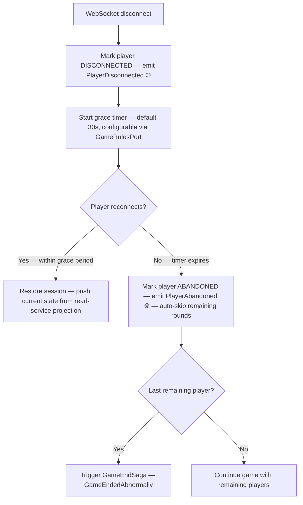

## WeaverChainSaga

**Trigger:** `SpecialActionPlayed` where `specialAction = THREAD`  
**Service:** `timeline-service`

The only saga that spans multiple eras. Remains open across era boundaries until completed, broken, or game ends.

### Steps

### Era boundary events

| Event | Outcome |
|---|---|
| `UNRAVEL` targets this chain | Emit `ChainBroken`, saga ends |
| `ANNIHILATE` removes a linked outcome | Emit `ChainLinkInvalidated`, length decremented |
| `GameEnded` with chain < 3 | Incomplete chain, no bonus |
| `GameEnded` with chain ≥ 3 | `ChainCompleted` already fired before `GameEnded` |

---

## PlayerReconnectSaga

**Trigger:** Player WebSocket disconnects during an active game
**Service:** `game-service` / session module

One saga instance runs per disconnecting player — multiple disconnects run independently in parallel.

### Steps

### Compensation

| Failure | Compensation |
|---|---|
| Player reconnects after `ABANDONED` | Reject reconnection — game already adapted |
| All players disconnect simultaneously | One `PlayerReconnectSaga` per player runs independently; last survivor triggers `GameEndSaga` if also abandoned |
| Timer service fails | Fallback: force abandonment after 2× grace period |
