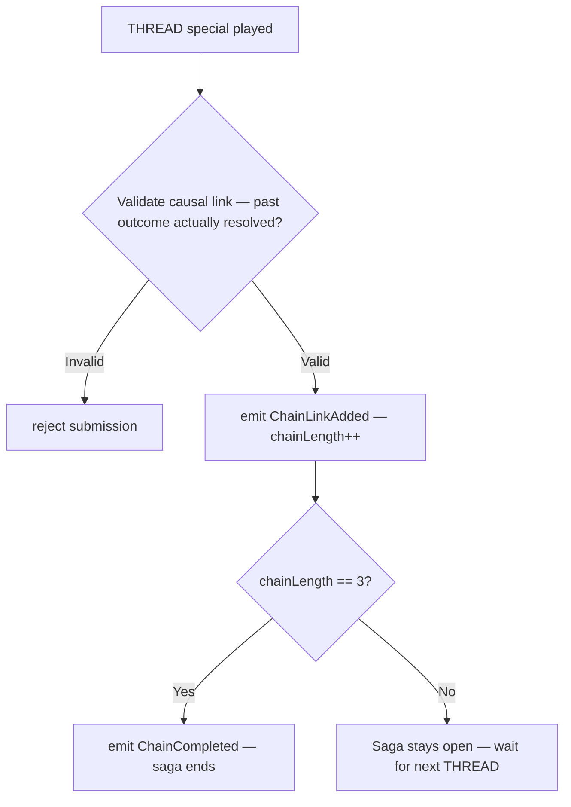
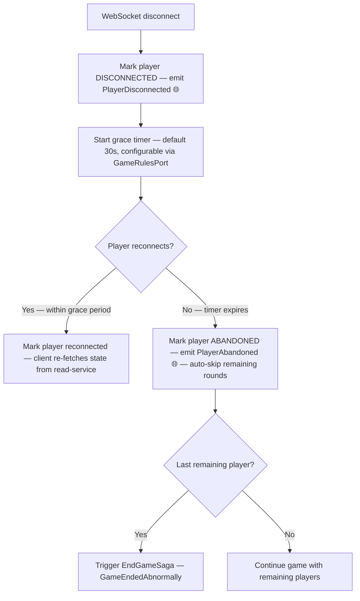

## WeaverChainSaga

<Info title="Planned">
`timeline-event` already defines the `ChainLinkAdded`, `ChainCompleted`, and `ChainBroken` messages this saga
produces. Implementation in `timeline-service` — the `WeaverChain` aggregate and this saga's causal-link
validation — is on the roadmap.
</Info>

**Trigger:** `SpecialActionPlayed` where `specialAction = THREAD`  
**Service:** `timeline-service`

The only saga spanning multiple eras — remains open across era boundaries until completed, broken, or the game
ends.

### Steps

```mermaid
flowchart TD
  A[THREAD special played] --> B{Validate causal link — past outcome actually resolved?}
  B -->|Invalid| C[reject submission]
  B -->|Valid| D[emit ChainLinkAdded — chainLength++]
  D --> E{chainLength == 3?}
  E -->|Yes| F[emit ChainCompleted — saga ends]
  E -->|No| G[Saga stays open — wait for next THREAD]
```

### Era boundary handling

| Event | Outcome |
|---|---|
| `UNRAVEL` targets this chain | Emit `ChainBroken`, saga ends |
| `ANNIHILATE` removes a linked outcome | Chain length decremented |
| `GameEnded` with chain < 3 | Incomplete chain, no bonus |
| `GameEnded` with chain ≥ 3 | `ChainCompleted` already fired before `GameEnded` |

---

## PlayerReconnectSaga

**Trigger:** Player WebSocket disconnects during an active game
**Service:** `game-service` / session module

One saga instance runs per disconnecting player — multiple disconnects run independently in parallel.

### Steps

```mermaid
flowchart TD
  A[WebSocket disconnect] --> B[Mark player DISCONNECTED — emit PlayerDisconnected 🌐]
  B --> C[Start grace timer — default 30s, configurable via GameRulesPort]
  C --> D{Player reconnects?}
  D -->|Yes — within grace period| E[Mark player reconnected — client re-fetches state from read-service]
  D -->|No — timer expires| F[Mark player ABANDONED — emit PlayerAbandoned 🌐 — auto-skip remaining rounds]
  F --> G{Last remaining player?}
  G -->|Yes| H[Trigger EndGameSaga — GameEndedAbnormally]
  G -->|No| I[Continue game with remaining players]
```

### Compensation

| Failure | Compensation |
|---|---|
| Player reconnects after `ABANDONED` | Reject reconnection — game already adapted |
| All players disconnect simultaneously | One `PlayerReconnectSaga` per player runs independently; last survivor triggers `EndGameSaga` if also abandoned |
| Timer service fails | Fallback: force abandonment after 2× grace period |
