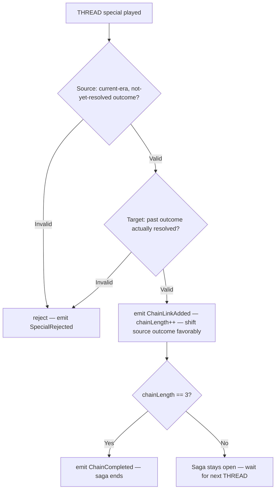
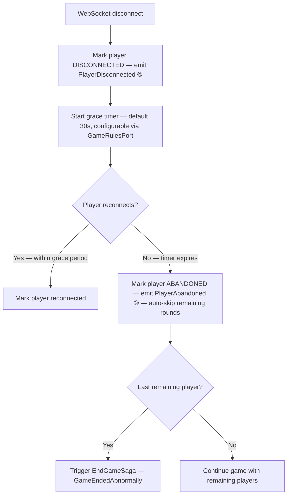

## WeaverChainSaga

**Trigger:** `SpecialActionPlayed` where `specialAction = THREAD`  
**Service:** `timeline-service`

The only saga spanning multiple eras — remains open across era boundaries until completed, broken, or the game
ends.

### Steps

```mermaid
flowchart TD
  A[THREAD special played] --> B{Source: current-era, not-yet-resolved outcome?}
  B -->|Invalid| C[reject — emit SpecialRejected]
  B -->|Valid| D{Target: past outcome actually resolved?}
  D -->|Invalid| C
  D -->|Valid| E[emit ChainLinkAdded — chainLength++ — shift source outcome favorably]
  E --> F{chainLength == 3?}
  F -->|Yes| G[emit ChainCompleted — saga ends]
  F -->|No| H[Saga stays open — wait for next THREAD]
```

### Era boundary handling

| Event | Outcome |
|---|---|
| `TAPESTRY` played (chain ≥ 2, not yet used this era) | Arm protection for the newest link — emit `ChainProtectionArmed` |
| `REWEAVE` played (once per era) | Discard newest link, re-anchor to a different resolved past outcome — emit `ChainReAnchored`, length unchanged |
| `GameEnded` with chain < 3 | Incomplete chain, no bonus |
| `GameEnded` with chain ≥ 3 | `ChainCompleted` already fired before `GameEnded` |

`ChainBroken` and its only historical trigger, Unravel (breaking another player's chain), are retired: at most one
Weaver chain can exist per game, so no reachable action ever produces it.

`ChainLinkInvalidated` — an Annihilate or Cascade erasing a linked outcome — is intended but currently unreachable:
a chain link only ever references an already-resolved outcome, and every erasure path refuses to act on one.
Tracked separately.

---

## PlayerReconnectSaga

**Trigger:** Player WebSocket disconnects during an active game
**Service:** `game-service` / session module

One saga instance runs per disconnecting player — multiple disconnects run independently in parallel.

### Steps

```mermaid
flowchart TD
  A[WebSocket disconnect] --> B[Mark player DISCONNECTED — emit PlayerDisconnected 🌐]
  B --> C[Start grace timer — default 30s, configurable via GameRulesPort]
  C --> D{Player reconnects?}
  D -->|Yes — within grace period| E[Mark player reconnected]
  D -->|No — timer expires| F[Mark player ABANDONED — emit PlayerAbandoned 🌐 — auto-skip remaining rounds]
  F --> G{Last remaining player?}
  G -->|Yes| H[Trigger EndGameSaga — GameEndedAbnormally]
  G -->|No| I[Continue game with remaining players]
```

This saga only tracks `game-service`'s connection bookkeeping. State restoration itself isn't one of its steps: a
reconnecting client opens a new `read-service` WebSocket connection, and `read-service` pushes a fresh game-state
snapshot on every connection it accepts — see [Reconnection](/api/websocket#reconnection) — independently of
whether this saga's grace period is still open.

### Compensation

| Failure | Compensation |
|---|---|
| Player reconnects after `ABANDONED` | Reject reconnection — game already adapted |
| All players disconnect simultaneously | One `PlayerReconnectSaga` per player runs independently; last survivor triggers `EndGameSaga` if also abandoned |
| Timer service fails | Fallback: force abandonment after 2× grace period |
